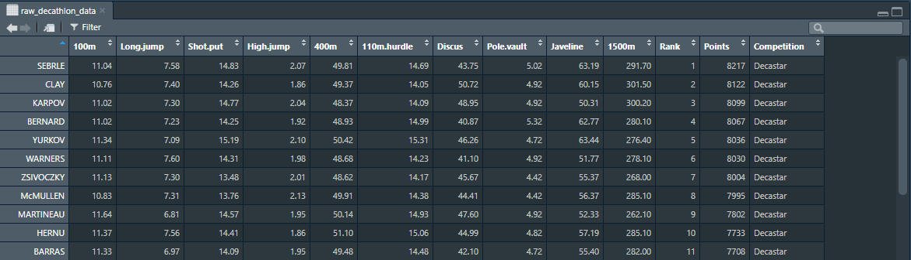
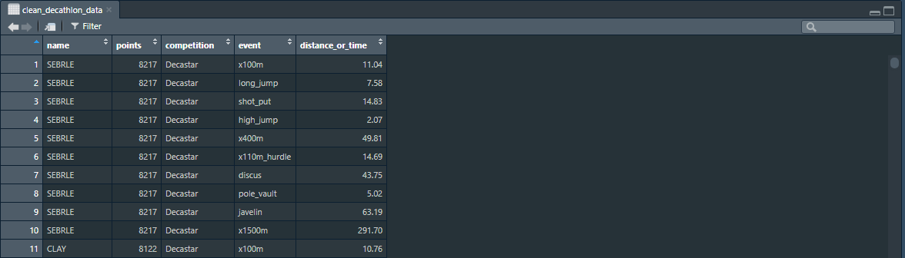

# Task 1 : Decathlon Data :running:

### Raw data overview

[data/raw_data](data/raw_data/) - raw data used for the specific task.

### Clean data overview

[data/clean_data](data/clean_data/) - data after it has been cleaned.

### Other files
[analysis](analysis/) - insight to the cleaned data. (.rmd)

[script](scripts/cleaning_script.R) - script that cleans the raw data. (.R)
    task_x.proj <- r project

task_1.proj - project file for RStudio
