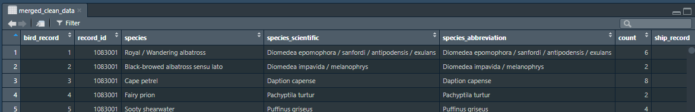

# Task 4: Sea bird observation :bird: :ship:

### Files

[analysis](analysis/) - insight to the cleaned data. (.rmd)

[script](scripts/cleaning_script.R) - script that cleans the raw data. (.R)

[task_3.proj]() - project file for RStudio

### Raw data preview

[data/raw_data](data/raw_data/) - raw data used for the specific task.

### Clean data preview

[data/clean_data](data/clean_data/) - data after it has been cleaned.

